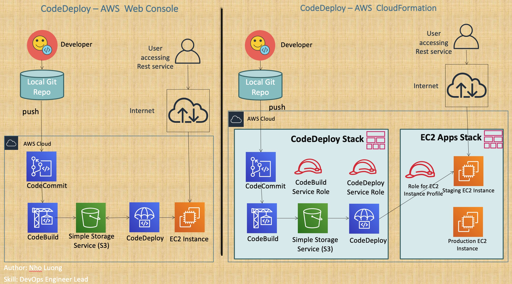

# AWS CloudFormation with Continuous Integration, Continuous Delivery and Infrastructure as Code Demos

### [View all Roadmaps](https://github.com/nholuongut/all-roadmaps) &nbsp;&middot;&nbsp; [Best Practices](https://github.com/nholuongut/all-roadmaps/blob/main/public/best-practices/) &nbsp;&middot;&nbsp; [Questions](https://www.linkedin.com/in/nholuong/)
 

# **Welcome to this Amazing source code on AWS CloudFormation.**

# AWS CloudFormation is a core Service in AWS which allows us to automate the Infrastructure and Application Deployments. 
- We will learn by practically implementing all the CloudFormation concepts with multiple examples. 
- We can achieve Continuous Integration, Continuous Delivery and Infrastructure as Code when using AWS CloudFormation in combination with AWS Developer Tools like AWS CodeCommit, AWS CodeBuild, AWS CodeDeploy and AWS CodePipeline. 

### **There are two parts to this source code. **
- In the first part of the source code you will learn all the AWS CloudFormation concepts by practically implementing them. Below are the sections for part one. 

# Part-1: AWS CloudFormation Fundamentals

01. Introduction to CloudFormation

02. YAML Essentials

03. Stack Features

04. Resources

05. Parameters

06. Mappings

07. Conditions

08. Outputs

09. Metadata

10. EC2 UserData

11. Metadata cfn-init & Helper Scripts (cfn-init, cfn-signal and cfn-hup)

12. Metadata cfn-init - Config Sets

13. Nested Stacks

# Part-2: Implement CloudFormation Templates for Continuous Integration, Continuous Delivery and Infrastructure as Code 
In the second part of the source code, you will implement the below listed three concepts using AWS CloudFormation & AWS Management Console.  You will write cloud formation templates for AWS Developer tools (AWS CodeCommit, CodeBuild, CodeDeploy & CodePipeline) to implement the CI, CD and IAC.

01. Continuous Integration (CI)

02. Continuous Delivery (CD)

03. Infrastructure as Code (IAC)

## **During the learning process, you will write 45+ cloud formation templates written in YAML.**

- This source code also provides 45+ pre-built templates which you can use them during the learning process. In addition this source code comes with 190 slides in a PDF document.

# 🚀 I'm are always open to your feedback.  Please contact as bellow information:
### [Contact ]
* [Name: Nho Luong]
* [Skype](luongutnho_skype)
* [Github](https://github.com/nholuongut/)
* [Linkedin](https://www.linkedin.com/in/nholuong/)
* [Email Address](luongutnho@hotmail.com)
* [PayPal.me](https://www.paypal.com/paypalme/nholuongut)

# License
* Nho Luong (c). All Rights Reserved.🌟

